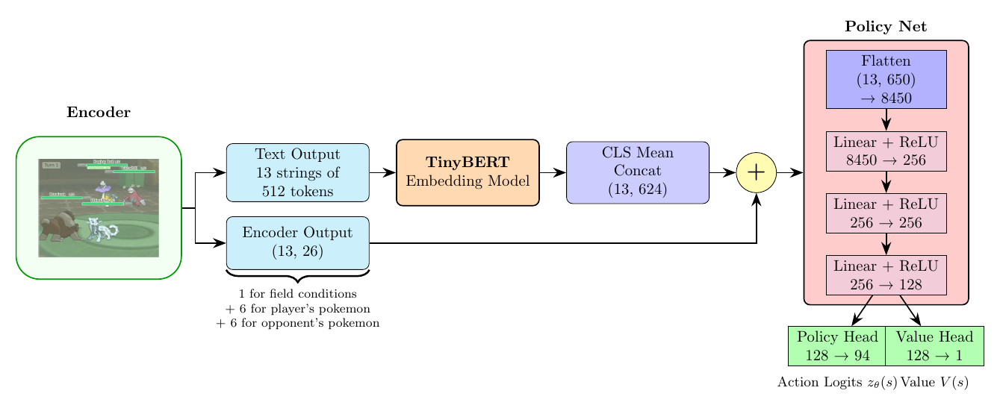
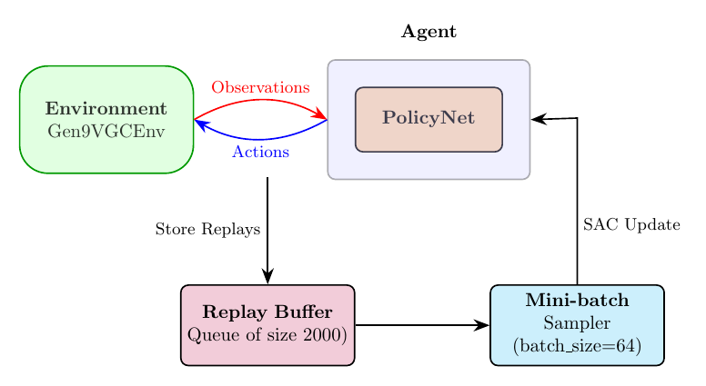

# VGC-RL

`WIKI.md` for all resources used.

VGC-RL is a reinforcement learning project aimed at developing a competent AI agent to play Pokémon VGC battles. The project uses the `poke-env` library to interact with a Pokemon Showdown server to play out games.

## Project Overview

The core idea is to train an agent that can analyze complex Pokémon battle states and make optimal decisions (e.g., choosing moves, switching Pokémon) to win battles. This involves:

1.  **Environment Interaction:** Using `poke-env` to simulate VGC battles against opponents (self play or against heuristics).
2.  **State Encoding:** Converting the battle state (Pokémon stats, moves, abilities, field conditions, etc.) into a numerical representation suitable for a neural network. This is achieved using the `TinyBERT` model to embed textual descriptions into vectors and concatenating with numerical features.
3.  **Policy Learning:** Training a deep neural network (`PolicyNet`) to learn a policy that maps encoded states to actions, aiming to maximize win rates.
4.  **Training Loop:** Implementing a robust training process using actor-critic methods and a replay buffer to continuously improve the agent's performance.

In order to reduce the large number of initial states possible to a manageable amount, the current implemenation of the project considers a fixed metagame of 6 teams with open team sheets, all from Regulation H 2.0 from Pokemon S/V (which was the latest format at the start of building out the project). 

## Project Structure

*   **`src/env.py`**: Defines `Gen9VGCEnv`, a Gymnasium-compatible environment built using code from `poke-env`. It handles the battle logic, action space definition specific to Doubles Battles for Gen 9. It also defines `SimEnv`, a complete implementation of the `Gen9VGCEnv` with reward calculation and observation embedding.
*   **`src/encoder.py`**: Responsible for transforming the raw battle state from `poke-env` into a structured observation for the `PolicyNet`. It uses a pre-trained `TinyBERT` model to encode textual descriptions of Pokémon, moves, and items, combined with numerical features.
*   **`src/policy.py`**: Implements the `PolicyNet`, a neural network that takes the encoded battle state as input. It features a shared backbone and separate heads for predicting action probabilities (policy) and estimating the state's value (value function).
*   **`src/rl_player.py`**: An extension of `poke-env`'s `Player` class that integrates the trained `PolicyNet` to make decisions during battles. It handles the conversion of network outputs back into `poke-env` battle orders.
*   **`src/train_loop.py`**: Describes the training loop, including environment interaction, experience collection (into a replay buffer), policy updates using an actor-critic algorithm in Pytorch, and checkpoint management.
*   **`src/teams.py`**: Provides functionality to load random teams from the list of teams in `teams/` for battle simulations.
*   **`src/lookups.py`**: Contains static data (dictionaries) for Pokémon, item, and move descriptions, used by the `encoder.py` to generate rich textual inputs for the `TinyBERT` model.




## Training Loop

The training process is implemented in `src/train_loop.py` and follows a standard reinforcement learning paradigm:

1.  **Environment Interaction:** The `RLPlayer` interacts with the `Gen9VGCEnv`, taking actions based on its current policy and receiving observations and rewards.
2.  **Experience Collection:** Each interaction (state, action, reward, next state, done) is stored in a replay buffer.
3.  **Policy Update:** Periodically, batches of experiences are sampled from the replay buffer. The `PolicyNet` is updated using an actor-critic loss function, which combines a policy loss (to improve action selection) and a value loss (to improve state value estimation) and an entropy term to reward exploring different policies (similar to SAC but with a fixed entropy coefficient).
4.  **Checkpointing:** The model's state is saved every 10 epochs under the `checkpoints`, allowing for training to be resumed or for evaluating different policy versions.




## Installation procedure

Clone the repo and initialize the pokemon-showdown submodule

```bash
git clone https://github.com/akkshay0107/vgc-rl.git
git submodule init
git submodule update --init --recursive
```

#### uv setup

- Install uv (see https://docs.astral.sh/uv/getting-started/installation/)

- Install all dependencies

```bash
uv sync
uv pip install .
```

- Run code through the venv (Alternatively, activate venv manually and use regular python commands)

```bash
uv run <command> [args..]
```

#### Local showdown server setup

From the root of the project,

```bash
cd pokemon-showdown
npm i # first time install
node pokemon-showdown start --no-security
```

It should default to starting the server at port 8000. Turn off any browser shields / blocker and retry if server fails to load properly.
